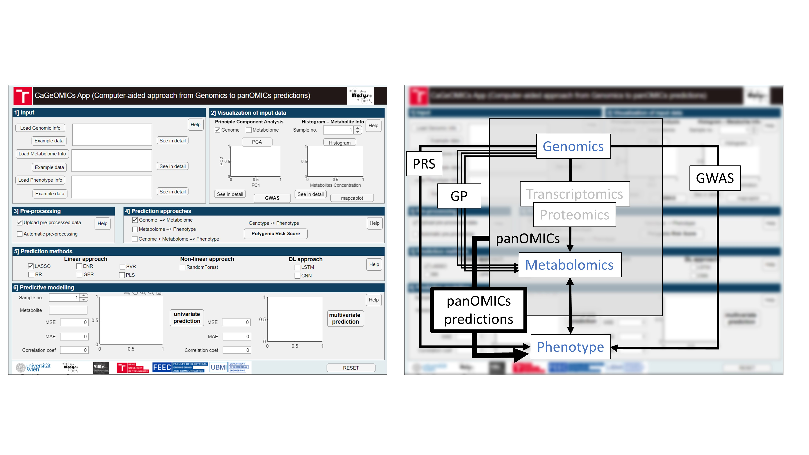

# CaGeOMICs App

Illustrated manual is available here: (CaGeOMICsApp_manual.pdf)

## Introduction

Advancements in sequencing technologies have propelled molecular biology research into the post-genomic era. Research now focuses on understanding functional relationships between individual genes and their impact on the final phenotype. 

The CaGeOMICs app, implemented using Matlab2023b App Designer, provides a user-friendly tool for uploading genomic and metabolomic data, visualizing it, and performing prediction analysis using various methods, including linear, non-linear, and deep learning techniques.

## Installation

To install the CaGeOMICs App, follow these instructions based on your Matlab setup:

- **If you have Matlab installed on your PC:**  
  You can run the app directly using the executable file provided. Navigate to the folder `CageApp1/for_testing/` and execute `CaGeOMICs.exe`.

- **If you do not have Matlab or a valid Matlab license:**  
  You can install the app using the standalone installer. Download and run `MyAppInstaller_web.exe` from the folder `CageApp_1/for_redistribution/` to install the application on your computer. After installation, download the folder with the input example data (available in path `CageApp_1/for_testing/input_example`) to the folder where you have the `.exe` application installed.

## Input

The first section of the app is designed for uploading data. The app expects genomic data in the form of SNP matrices, where '0' indicates an undetected SNP and '1' indicates a detected SNP. Users can also upload metabolomic data related to individual samples associated with the SNP data. Additionally, phenotypic data can be uploaded for calculating Polygenic Risk Scores (PRS) and panOMICs predictions.

- **Pre-processing:**  
  If the data has already been pre-processed, users can proceed directly to analysis. If pre-processing is needed, the app offers an automated pre-processing option. This feature fills missing values in genomic and phenotypic datasets with zeros, and for metabolomics data, it replaces missing values with half the minimum value and performs a log10 transformation on the absolute values.

### Tested Data

- **Arabidopsis thaliana (Ath) datasets:**  
  Includes 37 metabolites from 241 Arabidopsis ecotypes under two temperature conditions (6°C and 16°C). The core genotype data comprises 16,544 SNPs.

- **Barley datasets:**  
  Includes genotype matrices for 1,363 lines from the wild barley NAM population HEB-25, genotyped with a 50k Illumina SNP Array. The dataset includes 33,005 SNPs after quality control.

- **Mice Datasets:**  
  Focused on obesity-related traits, this dataset includes genomic and phenotypic data analyzed using Bayesian Generalized Linear Regression.

- **Human Datasets:**  
  Derived from Kaggle's "SNP dataset for GWAS", focusing on SNPs crucial for genome-wide association studies.

## Visualization

The 'Visualization' section enhances the understanding of individual input samples. Genomic information can be visualized using Principal Component Analysis (PCA), allowing users to observe the distribution of individual SNPs or metabolites. The app also includes GWAS calculations for genetic information, and for metabolite data, users can view the distribution of metabolite concentrations using histogram plots.

- **PCA Visualization:**  
  Use the `mapcaplot` function to create 2-D scatter plots of principal components.

- **GWAS Button:**  
  Prompts the user to add SNP information for correct rendering in the Manhattan plot.

## Prediction Approaches

The "Prediction Approaches" section offers users a range of options for making predictions, applicable to genomic predictions, metabolome predictions, OMICs predictions, and polygenic risk score (PRS) calculations.

### Polygenic Risk Score (PRS)

The PRS feature calculates an aggregate measure of genetic risk based on multiple SNPs associated with a particular phenotype. It provides a CSV file with the PRS results, which can be further analyzed or visualized.

## Prediction Methods

The core components of the app are the 'Prediction Methods' sections. Users can select their desired predictions and specify the methods to be used. The app offers nine different prediction methods, categorized into linear, non-linear, and deep learning approaches.

### Linear Approaches

- **LASSO (Least Absolute Shrinkage and Selection Operator) Regression**  
- **RR (Ridge Regression)**  
- **ENR (Elastic Net Regularization)**  
- **GPR (Gaussian Process Regression)**  
- **SVR (Support Vector Machine Regression)**  
- **PLS (Partial Least-Squares) Regression**  

### Non-Linear Approaches

- **RF (Random Forest)**  

### Deep Learning Approaches

- **LSTM (Long Short-Term Memory)**  
- **CNN (Convolutional Neural Network)**  

## Outputs (Results)

The results are divided into two parts, relying on genomics/metabolomics/OMICs prediction analysis. The prediction analysis is evaluated using mean square error (MSE), mean absolute error (MAE), and correlation coefficient (cc). Additionally, the software allows for visualizing a box plot of predicted and original values.

### Univariate Prediction

Focuses on single metabolites. Users can select the metabolite using the slider button and wait for the prediction analysis results.

### Multivariate Prediction

Includes all metabolites. The usage is analogous to univariate prediction.

At the end, the user can either switch to another method in the "Prediction Methods" section and run a new prediction or use the RESET button to restore the application to its default settings.

## Literature

1. Weiszmann, Jakob, et al. "Metabolome plasticity in 241 Arabidopsis thaliana accessions reveals evolutionary cold adaptation processes." Plant physiology 193.2 (2023): 980-1000.
2. Gemmer, M.R., et al. "Can metabolic prediction be an alternative to genomic prediction in barley?." PLoS One, 15(6), p.e0234052 (2020).
3. Villar‐Hernández, B.D.J., et al. "A Bayesian optimization R package for multitrait parental selection." The Plant Genome, p.e20433 (2024).
4. Bojer, C.S., and Meldgaard, J.P. "Kaggle forecasting competitions: An overlooked learning opportunity." International Journal of Forecasting, 37(2), pp.587-603 (2021).

This work has been supported by grant FEKT-K-21-6878, realized within the project Quality Internal Grants of BUT (KInG BUT), Reg. No. CZ.02.2.69 / 0.0 / 0.0 / 19_073 / 0016948, which is financed from the OP RDE.

